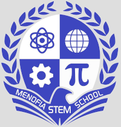

 
# Welcome fab lab menofia 
Welcome to fab lab menofia Stem school  repository, this is created document the training contents, it is two weeks training, we trained at almaadi stem school.
# About me

My name is shokry gorge , i am a fab lab manager at menofia stem school, it is a secondary school, i have been there for about two years, i am responsible of helping students at their projects using the available machines and tools.

# Tables of contents

1.[Installing UBUNTU](file.md/installing-ubuntu.md)

2.[Terminals notes](file.md/notes-about-terminal.md)

3. [Visual studio code](file.md/visual-studio-code.md)

4. # [Github](file.md/github.md)
    
    4.1. [Github Notes](file.md/dealing-with-github.md)
    
    4.2. [Converting from http to ssh](file.md/http-ssh.md)
5. # Machines

    ## 5.1.[Vinyl cutter](file.md/vinyl.md)

   ## 5.2. [shop bot](/file.md/shopbot.md)
7. [Notes](file.md/notes.md)
8. [Project managements](file.md/project-management.md)
9. [Websites](file.md/websites.md)
11. [Tasks](file.md/tasks.md)
12. [commit](file.md/commit.md)
13. [Project created from Basic kanban template. ](file.md/project.md)
14. [changecomit](file/changecomit.md)
15. [inkscapnotes](file/inkscapnotes.md)

16. [installmodls](file/instal.md)
## References
mail : 

shokry.eshak@stemmenof.moe.edu.eg

shokry29@gmail.com

Github :

https://github.com/shokry2929
/
Fablabs :

https://fablabs.io/users/shokry

Facebook :

https://www.facebook.com/groups/247769755891334/