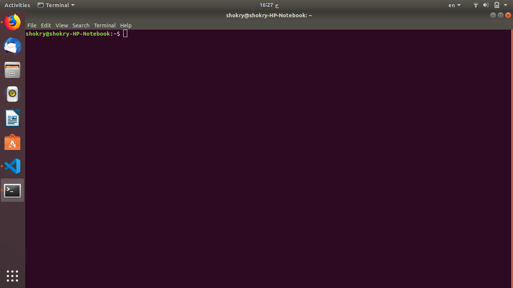

# Terminal Commands

- ls : used to list all content of the current directory
- clear : used to clear the screen of it's contents
- pwd : used to show the current directory
- cd .. : used to go back one directory
- cd : used to go to the home directory
- cd - : used to go to the last directory
- cd Arduino : used to change current directory to Arduino
- mkdir : used to make directory
- touch : used to make new file
- cat : used to show what is inside the file
- echo : used to show a message on the screen
- echo hello > readme.md : used to send hello to readme.md file
- man : used to show manual
- nano : used to edit text file
- git status : used to know the status of the md file i want to push
- convert : used to manipulate images, resize and rotate and etc.
- rm : used to delete files and folders

[Go back to readme file](readme.md)